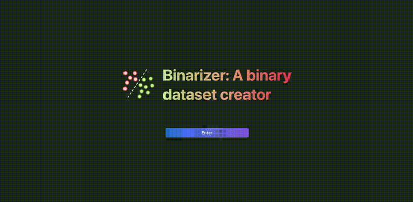

<p align="center">
  <picture>
    <source media="(prefers-color-scheme: dark)" srcset="media/binarizer-logo-dark.png" width="100">
    <source media="(prefers-color-scheme: light)" srcset="media/binarizer-logo-light.png" width="100">
    
  </picture>
</p>
<h3 align="center">Binarizer</h3>
<p align="center">Tool for manual classification of tweets to build a binary classification dataset<p>
<p align="center">
    
    
</p>

---

# Binarizer

Tool for manual classification of tweets to build a binary classification dataset using [AHBCC](https://github.com/lhbelfanti/ahbcc).

It was mainly developed for binary classification of whether a tweet discusses 'illicit drug use' (one of the Adverse Human Behaviors, see more [here](https://github.com/lhbelfanti/ahbcc/blob/main/README.md)).

## Preview


## Setup

To run the application, you must define specific environment variables.
You can create a .env file in the root directory of the project or rename the provided example file, .env.example.

This file should contain the following environment variables:
```
# App settings
BINARIZER_EXPOSED_PORT=<Binarizer Host Port>
BINARIZER_INTERNAL_PORT=<Binarizer Container Port>

# Web
SESSION_SECRET=<Secret key used for signing and verifying HMAC-based tokens>

# External APIs URLs
VITE_CORPUS_CREATOR_API_URL=<URL of the web page>
```

Replace the `< ... >` by the correct value. For example: `BINARIZER_EXPOSED_PORT=<Binarizer Host Port>` --> `BINARIZER_EXPOSED_PORT=3100`.

### Run
Just run `docker-compose up`.

#### Session secret key

The value of the session secret key should be a random and long byte sequence that isn't easily guessable.

An example of how to generate this key is by using a tool like `OpenSSL` or a `password generator`.
```bash
openssl rand -base64 32
```
This generates a 256-bit (32-byte) key encoded in Base64, which is suitable for HMAC-SHA256.

---

## License

[MIT](https://choosealicense.com/licenses/mit/)
